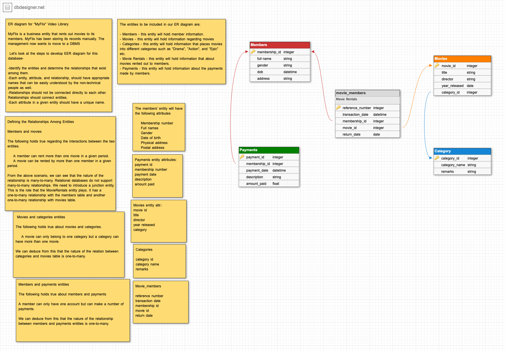

# vit-en-database-9

# Database Week 1 - Homework

**Note:** In order to create your ER diagrams, you can use [dbdesigner](https://www.dbdesigner.net/), [pgadmin](https://www.pgadmin.org/), [lucidchart](https://www.lucidchart.com/) or any other tool you like.

## 1. Entity Relationship Diagram

Your task is to design and describe the database of a company.

- You are working in a IT company where multiple small teams deliver one product each. Every member of a team have a responsibilitiy (title) such as product owner, backend developer, frontend developer, data engineer etc. Also each product is being developed for a different customer, and these customers are serving within different domains. Your task is to design and create a database where you can handle (store and retrieve) all these information.

Your tasks:

- Choose your entities, write down their attributes.

- Create tables for these entities according to normalization rules.

- Explain the relationships between entities.

- Create an entity relationship diagram where you display all these information graphically.

Below is an example ERD. Try to come up with a similar end result. Good luck!

## 2. Sakila Database

The [Sakila database](https://dev.mysql.com/doc/sakila/en/) was initially developed by Mike Hillyer, a former member of the MySQL AB documentation team. It is intended to provide a standard schema that can be used for examples in books, tutorials, articles, samples, and so forth.

The database contains 16 tables and the following diagram provides an overview of Sakila database structure.

Load the Sakila database on [SQLite Online](https://sqliteonline.com/) and start exploring the DB.
